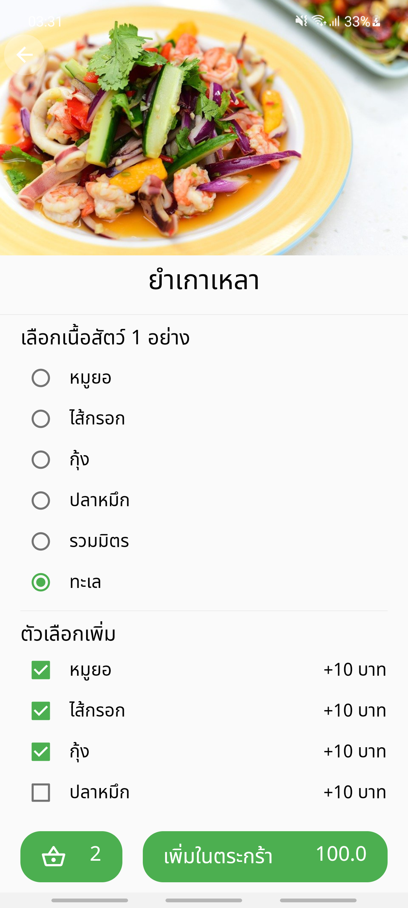

# Flutter Food Delivery
 
### About

* State Management
    + Provider
* Packages 
    + Google maps 
    + Http 
    + Dotenv 
    + Shared Preferences
* APIs
    +  Google Maps API
    +  Line Notify API

### Screen

<!-- :white_check_mark: : Finish 
:parking: : Inprogress 
:soon: : Plan 
:x: : Abandon  -->

- :white_check_mark: HomeScreen 
- :white_check_mark: FoodScreen
- :white_check_mark: BasketScreen
- :soon: PaymentScreen
<!-- - :soon: OrderScreen -->
 

### Screenshort

- HomeScreen  

  

- FoodScreen  

  

- BasketScreen  

  

