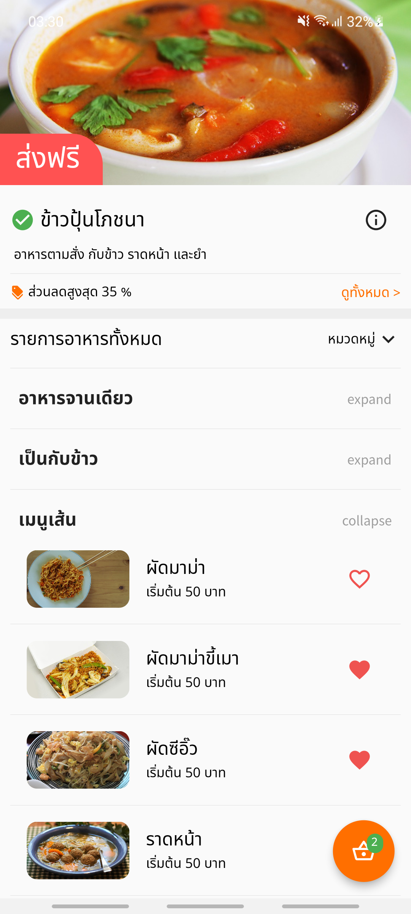

# Flutter Food Delivery

### Screen

<!-- :white_check_mark: : Finish 
:parking: : Inprogress 
:soon: : Plan 
:x: : Abandon  -->

- :soon: HomeScreen
- :soon: FoodDetailScreen
- :soon: CartScreen
- :soon: PaymentScreen
- :soon: OrderScreen

### Screenshort
 

- HomeScreen (example)  

  

